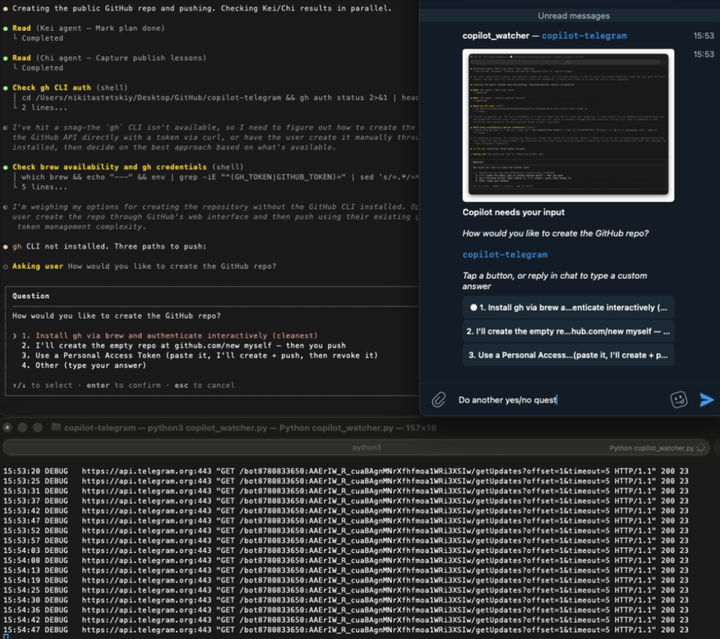

# copilot-telegram

Telegram bridge for GitHub Copilot CLI's interactive prompts — answer permission
questions, pick options, and reply to ask_user widgets from your phone.

## Why

Long-running Copilot CLI sessions block whenever the agent needs your input: a
permission prompt, a model picker, a clarifying question. This script watches a
Terminal.app window and forwards those prompts to Telegram with inline buttons,
so you can unblock the session from your phone without sitting at your desk.

## Demo



## Status

v0.1.0. macOS-only, single-file script. Works well enough to be useful day-to-day
but should be considered a personal tool made publishable — not a polished product.
iTerm2 and Linux support are not planned for v0.1.

## Requirements

- macOS (uses AppleScript + Terminal.app's scripting interface)
- Terminal.app — **not** iTerm2 (feel free to PR support)
- Python 3.11 or later
- A Telegram bot token from [@BotFather](https://t.me/BotFather) and your chat id
- Optional: `pyobjc-framework-Quartz` for stable window-id resolution; falls back
  to AppleScript bounds without it, but screenshots may capture the wrong content
  if the window moves

## Install

```bash
git clone https://github.com/nikitastetskiy/copilot-telegram
cd copilot-telegram
pip install -r requirements.txt

# Optional but recommended for stable screenshots:
pip install pyobjc-framework-Quartz
```

## Configure

**Create a Telegram bot:**

1. Open Telegram and message [@BotFather](https://t.me/BotFather)
2. Send `/newbot` and follow the prompts
3. Copy the **bot token** — it looks like `1234567890:ABCDefGhIJKlmNoPQRsTUVwxyZ`

**Get your chat id:**

1. Send any message to your new bot
2. Use `curl` to retrieve your updates — use `curl` rather than a browser URL to avoid leaking the token to history/referrer/screen-sharing:
   ```bash
   curl -s "https://api.telegram.org/bot<YOUR_BOT_TOKEN>/getUpdates" | python -m json.tool
   ```
3. Find `"chat":{"id":...}` in the response — that number is your `CHAT_ID`

**Set up your `.env`:**

```bash
cp .env.example .env
# Edit .env and fill in BOT_TOKEN and CHAT_ID
```

See `.env.example` for all supported variables.

The screenshot path defaults to `~/.copilot_prompt.png`; set `SCREENSHOT_PATH` in `.env` to override.

## Run

```bash
python3 copilot_watcher.py
```

If `TARGET_WINDOW_NAME` is set in `.env`, the script picks that Terminal window
automatically; otherwise it shows an interactive picker.

**Flags:**

| Flag | Short | Description |
|------|-------|-------------|
| `--pick` | `-p` | Opens an interactive list of all open Terminal windows (excluding this script's own window); type a number to select one, then the watcher starts monitoring that window. Ignores `TARGET_WINDOW_NAME`. |
| `--dump [path]` | | Captures the chosen window's current terminal history to stdout or a file and exits. No Telegram credentials required — safe for offline debugging. |
| `--version` | `-V` | Print version and exit |
| `--help` | `-h` | Show usage |

## What it does

- Polls the selected Terminal window's tty history every ~2 seconds
- Detects Copilot CLI's Ink `<SelectInput>`, `ask_user` text widgets, and shell
  `[y/N]` prompts
- Sends a screenshot of the window plus inline-keyboard buttons to your Telegram chat
- When you tap a button (or type a free-text reply), the response is injected back
  into the original Terminal window via AppleScript — without touching the clipboard
  or whichever window happens to be focused

## Privacy & Data Handling

- **Terminal screenshots are uploaded to Telegram.** Every time a prompt is detected, a screenshot of the watched Terminal window is sent via the Telegram Bot API. It will be visible in the configured Telegram chat and may be retained per [Telegram's data retention policy](https://telegram.org/privacy).
- **The bot can see any text on screen.** The watcher reads all text visible in the Terminal window when a prompt appears. Do not run this watcher on a window that may display secrets, API keys, passwords, customer data, or other sensitive content.
- **The bot token goes only to `api.telegram.org`.** It is never sent to any other party. Keep it in `.env` (which is gitignored) and never commit it to version control.
- **Screenshot artifacts are written locally first.** Screenshots are saved to `~/.copilot_prompt.png` before upload and deleted immediately after a successful send. Override the location with `SCREENSHOT_PATH` in `.env`. If upgrading from an earlier version that used `/tmp/copilot_prompt.png`, delete any leftover file at that path.
- **`--dump` never contacts Telegram.** The `--dump` flag captures a text snapshot of the window, writes it locally, and exits — no screenshot is uploaded and no Telegram credentials are required. Safe for offline debugging.
- **Unparsed-screen dumps** are written locally to `~/copilot_watcher_unparsed_*.txt` and auto-pruned by the script. They are never sent anywhere.

## Troubleshooting

**"No window matching X"**

Run `python3 copilot_watcher.py --pick` to open the interactive window picker, select a
window by number, and start monitoring it. Or pass the title substring or 1-based index
directly if you already know it:

```bash
python3 copilot_watcher.py --pick
python3 copilot_watcher.py 2          # pick by index
python3 copilot_watcher.py "my title" # pick by substring
```

**Prompt not detected**

Run `python3 copilot_watcher.py --dump ~/screen.txt` and share the file when
opening an issue. The script also auto-dumps suspect screens to
`~/copilot_watcher_unparsed_*.txt`.

**Screenshot empty or capturing the wrong window**

Install `pyobjc-framework-Quartz` for stable Quartz-based window targeting:

```bash
pip install pyobjc-framework-Quartz
```

Without it, the fallback uses AppleScript-reported window bounds, which can grab
the wrong region if the window moved.

**Button tap selects the wrong option**

Should be fixed in v0.1.0 (delta navigation via arrow-key sequences). If you still
see it, open an issue with the screen dump and the buttons you tapped.

## How it works

**Window selection:** At startup, enumerates Terminal.app windows via AppleScript
and resolves the Quartz CG window id once. This id is used for all subsequent
screenshot calls and keystroke injection, so the target never drifts even if
window order changes.

**Screen parsing:** Every 2 seconds, fetches the window's tty history via
AppleScript, strips ANSI/OSC/DCS escape sequences, and looks for Ink
box-drawing rectangles in the active widget region (bottom 20 lines). Classifies
the screen as `selection`, `text_input`, `yes_no`, or `idle`. Details in source
comments.

**Response injection:** Digit input becomes delta-navigation arrow-key sequences
sent via System Events targeting the specific window id — never the frontmost
window. Free text uses `do script ... in window id N without entering` for clean
byte injection with no clipboard involvement.

## Development

```bash
pip install -r requirements-dev.txt
pytest
```

All tests are fixture-based — no live Terminal interaction required. CI runs the
suite on macOS across Python 3.11, 3.12, and 3.13.

## Contributing

Open issues with screen dumps attached; PRs are welcome, especially for iTerm2
support, Linux/Windows alternatives, and model picker UX improvements. Run
`pytest tests/ -v` before submitting a PR.

## License

MIT — see [LICENSE](LICENSE).
